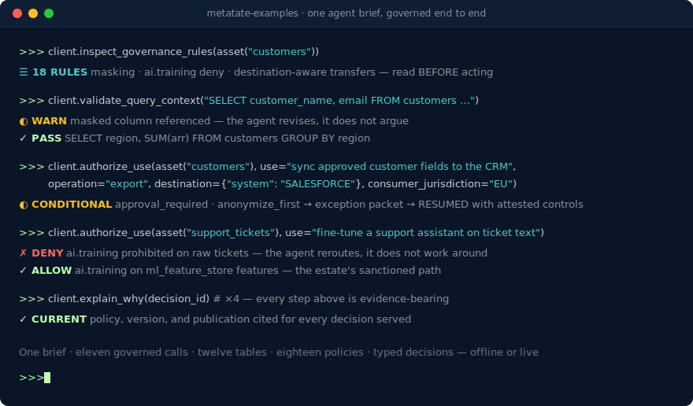

# Metatate Examples



Metatate is a programmable decision layer for governed data. It gives agents and workflows structured context about meaning, policy, allowed use, transfer rules, and decision rationale before they touch data.

This repository is the public examples cookbook for **Metatate Cloud**. It uses one synthetic B2B SaaS company, AcmeCloud, so every notebook builds on the same tables, policies, and expected decisions.

Prefer these workflows inside your coding agent? Installable integration
plugins live in
[metatate-claude-plugins](https://github.com/metatateai/metatate-claude-plugins)
(the `metatate` plugin targets Metatate Cloud).

Running Metatate as the **Snowflake Native App**? That examples pack lives at
[metatate-snowflake-examples](https://github.com/metatateai/metatate-snowflake-examples)
(stable / maintenance mode).

## Run It Live In 5 Minutes

Offline mode works with zero setup, but the fastest way to feel the decision
layer is to run these notebooks against a **live governed workspace of your
own**:

1. **Create a free Metatate account** at
   [app.getmetatate.com/sign-up?ref=examples](https://app.getmetatate.com/sign-up?ref=examples)
   and create a workspace (the free plan covers everything these examples do).
2. On your new workspace's dashboard, follow the **"New here?" banner → Load
   the demo**, then click **Load the AcmeCloud demo** — it provisions the
   exact governed domain this repo uses (five tables, three policies, one
   live publication).
3. Open **MCP Tools → Tokens** and issue an access token (shown once).
4. Point the notebooks at your workspace:

   ```bash
   export METATATE_EXAMPLES_MODE=live
   export METATATE_MCP_URL=https://<your-workspace-mcp-endpoint>/mcp   # MCP Tools → Connect
   export METATATE_SAAS_MCP_TOKEN=mtt_...
   ```

Full details (and the local-stack path for contributors) are in
[docs/live-mode-saas.md](docs/live-mode-saas.md).

## Demo Domain

AcmeCloud covers customer operations, revenue, product usage, support, and prepared exports.

Governed tables:

- `ACMECLOUD_DEMO.PUBLIC.CUSTOMERS`
- `ACMECLOUD_DEMO.PUBLIC.SUBSCRIPTIONS`
- `ACMECLOUD_DEMO.PUBLIC.PRODUCT_USAGE_EVENTS`
- `ACMECLOUD_DEMO.PUBLIC.SUPPORT_TICKETS`
- `ACMECLOUD_DEMO.PUBLIC.CUSTOMER_EXPORTS`

Demo policy behavior:

- customer PII can be used for analytics and reporting only with minimization or masking
- direct marketing and advertising are blocked unless a consent-specific workflow is added
- customer records and support tickets are blocked for model training
- customer exports require destination-aware authorization
- Salesforce exports are conditional; advertising-platform exports are denied

## Notebook Pack

| Notebook | What it shows |
| --- | --- |
| `00_setup_live_or_offline.ipynb` | Environment check and context discovery. |
| `01_decision_layer_cookbook.ipynb` | Core Metatate flow: discover, inspect, authorize, validate, explain. |
| `02_governed_sql_agent_langgraph.ipynb` | A small governed SQL-agent pattern with optional LangGraph. |
| `03_transfer_governance_before_export.ipynb` | Destination-aware transfer decisions before export. |
| `04_governed_text_to_sql_agent.ipynb` | Text-to-SQL that validates and revises SQL before returning it. |
| `05_agent_red_team_evaluation_harness.ipynb` | Repeatable risky-prompt checks for governed agents. |
| `06_ci_gate_for_data_ai_changes.ipynb` | A runnable CI/CD policy gate for SQL, export, and AI workflow changes. |
| `07_governed_rag_embedding_ingestion_gate.ipynb` | Pre-ingestion checks before data enters RAG or embedding workflows. |
| `08_openai_agents_tool_guard_pattern.ipynb` | A deterministic tool guard pattern for OpenAI Agents SDK-style apps. |
| `09_human_approval_packet_for_conditional_export.ipynb` | Human-in-the-loop exception workflow for safe, conditional, and denied requests. |
| `10_llamaindex_governed_retrieval_pattern.ipynb` | A governed retrieval function that can be wrapped as a LlamaIndex tool. |
| `11_langgraph_governed_sql_agent_runtime.ipynb` | LangGraph runtime SQL agent with approve, revise, and block routes. |

The notebooks run in two modes:

- **Offline:** default; uses committed JSON fixtures and needs no account.
- **Live:** the same pack against your Metatate Cloud workspace's MCP endpoint
  with a workspace bearer token (see
  [docs/live-mode-saas.md](docs/live-mode-saas.md)).

Notebook `11_langgraph_governed_sql_agent_runtime.ipynb` requires the framework
dependencies from `requirements-framework.txt`.

Notebooks are generated from `scripts/build_notebooks.py`; edit that script and
regenerate — CI fails on drift (`scripts/build_notebooks.py --check`).

## Validation Scope

Pull requests run the offline validation workflow in
`.github/workflows/offline-ci.yml`, which executes the full notebook pack,
the acceptance suites, and the static checks. Release candidates should also
run the manual live SaaS workflow in
`.github/workflows/live-saas-mcp-validation.yml` against a workspace serving
the AcmeCloud demo publication.

Runtime coverage is separate from core notebook execution:

- `06_ci_gate_for_data_ai_changes.ipynb` is backed by the reusable `cicd_policy_gate` package and an acceptance script.
- `02_governed_sql_agent_langgraph.ipynb` is paired with a deterministic LangGraph `StateGraph` runtime acceptance script.
- `11_langgraph_governed_sql_agent_runtime.ipynb` is paired with a multi-node LangGraph agent runtime acceptance script.
- `08_openai_agents_tool_guard_pattern.ipynb` is paired with a deterministic OpenAI Agents SDK `FunctionTool` runtime acceptance script.
- `09_human_approval_packet_for_conditional_export.ipynb` is backed by the reusable `human_exception_workflow` package and an acceptance script.
- `10_llamaindex_governed_retrieval_pattern.ipynb` is paired with a deterministic LlamaIndex `FunctionTool` runtime acceptance script.

The LangGraph, OpenAI, and LlamaIndex runtime checks invoke real framework objects, but they intentionally do not call an LLM. Review [docs/validation-matrix.md](docs/validation-matrix.md) and [docs/framework-runtime-acceptance.md](docs/framework-runtime-acceptance.md) for the exact coverage.

## Quick Start

```bash
python3 -m venv .venv
source .venv/bin/activate
pip install -r requirements.txt
jupyter notebook notebooks
```

To execute the full pack offline:

```bash
scripts/run_notebook_pack.sh
```

To run the CI/CD policy gate locally:

```bash
scripts/run_cicd_policy_gate.sh
scripts/run_cicd_policy_gate_acceptance.sh
```

Use `scripts/run_cicd_policy_gate.sh --strict` for a CI-style non-zero exit when denied changes are present. See [docs/ci-cd-policy-gate.md](docs/ci-cd-policy-gate.md).

To run the human-in-the-loop exception workflow locally:

```bash
scripts/run_human_exception_workflow.sh
scripts/run_human_exception_workflow_acceptance.sh
```

See [docs/human-exception-workflow.md](docs/human-exception-workflow.md).

Review [docs/release-process.md](docs/release-process.md) before tagging a public release.

To run the framework runtime acceptance checks:

```bash
python3 --version  # confirm Python 3.10+
python3 -m venv .venv-framework
source .venv-framework/bin/activate
pip install -r requirements-framework.txt
scripts/run_framework_runtime_acceptance.sh
```

Use Python 3.10 or newer for framework runtime acceptance.

To execute the LangGraph runtime notebook:

```bash
python3 -m venv .venv-framework
source .venv-framework/bin/activate
pip install -r requirements-framework.txt
scripts/run_langgraph_runtime_notebook.sh
```

## Live Mode

Live mode points every Metatate decision call at your Metatate Cloud
workspace's MCP endpoint over MCP, authenticated with a workspace-issued
access token. The notebooks still run locally.

```bash
pip install -r requirements-live.txt
cp .env.example .env
```

Configure `.env` with your endpoint, keep the token in your shell, and see
[docs/live-mode-saas.md](docs/live-mode-saas.md) for the full walkthrough
(including the local-stack path for contributors).

## Repository Map

```text
.github/workflows/               Offline PR CI and manual live SaaS validation
common/                         Shared Python client helpers
cicd_policy_gate/               Reusable CI/CD policy gate example
docs/                           Setup, demo model, and troubleshooting
human_exception_workflow/       Human review and exception workflow example
notebooks/                      Notebook-first walkthroughs (generated)
sample-data/acmecloud/tables/   Small synthetic CSV tables
sample-data/acmecloud/policies/ Example policy YAML
sample-data/acmecloud/metatate-responses/
                                Offline Metatate response fixtures
sample-outputs/                 Curated expected output summaries
scripts/                        Validation and notebook execution helpers
```

## Links

- Metatate docs: https://docs.getmetatate.com
- Metatate App: https://app.getmetatate.com
- Snowflake Native App examples: https://github.com/metatateai/metatate-snowflake-examples
